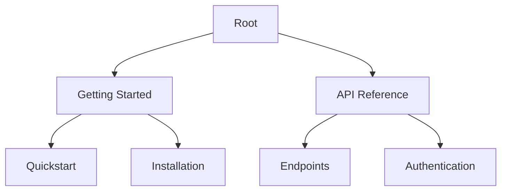

## Key Features Overview

Bai Xiao provides powerful tools to streamline your documentation workflow. You create, organize, search, and track changes efficiently in a collaborative environment.

<Columns cols={2}>
  <Card title="Document Creation" icon="edit-3" href="#document-creation">
    Build pages quickly with rich text, code blocks, and embeds.
  </Card>
  <Card title="Organization" icon="folder" href="#organization">
    Structure content using folders and nested pages.
  </Card>
  <Card title="Search & Filter" icon="search" href="#search">
    Find information instantly across your docs.
  </Card>
  <Card title="Version History" icon="git-branch" href="#version-history">
    Track and revert changes with full history.
  </Card>
</Columns>

## Document Creation and Editing

Start new documents directly from the dashboard or within folders. You access a full-featured editor supporting markdown, rich text, and MDX components.

<Steps>
  <Step title="Create New Page" icon="plus">
    Click the `+ New Page` button. Choose a template like "API Reference" or "Guide".
  </Step>
  <Step title="Edit Content" icon="edit">
    Use the visual editor for quick formatting or switch to markdown mode.
  </Step>
  <Step title="Add Components" icon="components">
    Insert `<Callout>`, `<Tabs>`, or code blocks via the toolbar.
  </Step>
  <Step title="Publish" icon="upload">
    Save and publish to make it live for your team.
  </Step>
</Steps>

<Tabs>
  <Tab title="Rich Text" icon="type">
    Drag-and-drop images and format text intuitively.
  </Tab>
  <Tab title="Markdown" icon="code">
    Write in standard markdown with live preview.
  </Tab>
</Tabs>

<Callout kind="tip">
  Enable real-time collaboration by inviting team members to co-edit pages.
</Callout>

## Folder and Page Organization

Organize your documentation hierarchically. Create folders to group related pages, mimicking your project's structure.



Use drag-and-drop to reorder pages or nest them deeply.

<CodeGroup tabs="Sidebar,Search">
  ```javascript
  // Access via sidebar navigation
  navigateTo('/docs/getting-started/quickstart');
  ```
  ```javascript
  // Search and navigate programmatically
  searchDocs('quickstart').then(openPage);
  ```
</CodeGroup>

## Search and Filtering Options

Bai Xiao's search indexes all content instantly. Filter by tags, folders, or update date.

<Expandable title="Advanced Filters" default-open="false">
  Combine filters like `tag:api updated>2024-01-01 folder:reference`.
  
  | Filter Type | Example | Description |
  |-------------|---------|-------------|
  | Tags       | `tag:feature` | Matches pages with specific tags |
  | Date       | `updated>2024` | Recent changes only |
  | Folder     | `folder:api`  | Scope to subfolders |
</Expandable>

## Version History and Updates

Every edit creates a snapshot. View diffs, restore previous versions, or compare changes.

<Callout kind="info">
  Automatic backups run every 5 minutes, ensuring no data loss.
</Callout>

Access history via the page menu:

1. Click `History` icon.
2. Select a version to preview.
3. Restore or copy content.

This keeps your docs reliable and auditable for teams. Explore these features to boost your productivity.